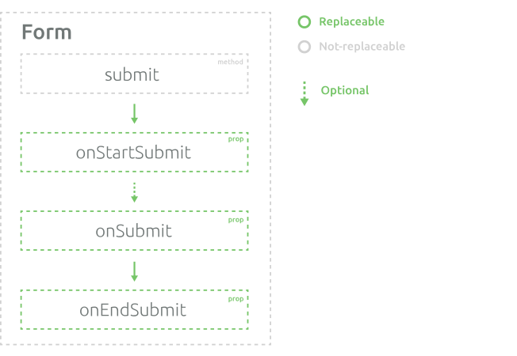

# Submission

To submit form you need to invoke `submit(params)` method. This method is not customizable itself, but it invokes customizable prop `onStartSubmit` and then `onEndSubmit`.

## Default behavior

### `onStartSubmit`

**Params:** `form`, `params` (params, that were passed to `submit` method)

**Returns:** promise, that should be resolved on end submission

First of all, there are some preparations:
- Set `submitting` form meta to `true`.
- Set `touched` for all fields 
- Increment `submitCount` + 1

Next, it runs general form validation. If form is valid after validation, it calls `onSubmit` method. 

### `onSubmit`

**Params:** `form`, `params`

**Returns:** promise, that should be resolved on end submission

By default, the behavior of this method is not defined. It's designated to run your submit request.

### `onEndSubmit`

**Params:** `form`, `params`

This method calls every time when submit is completed. By default, it just sets `submitting` to `false`.
