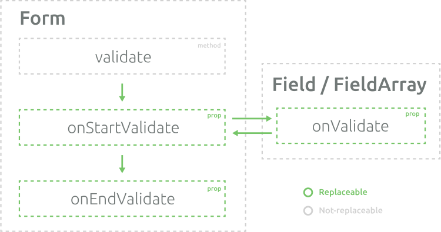

# Validation

This library is designed to allow developer add validation easily and painless and wildly customize in the same time.


Conceptually, the validation can be perceived just as uniform way to set the form and fields meta. Literally. 
This approach give the simple way to customize validation, that will be illustrated in the last section.

The first sections is dedicated to description of the default validation behaviour implemented in this library, but
you should remember, that this behavior can be completely replaced.

## Form-level validation

Form-level validation is intented to validate all fields at the same time, especially when they are depend on each other.
To enable form-level validation you should pass your custom function to `validate` prop of `Form` component. The function can be 
synchronous or asynchronous (return a Promise)


```html
<Form :validate="validate">
  ...
</Form>
```

```js
validate({ values, form }) {
	return {
		error: {
			name: values.name === 'immortal' ? 'You should not use this name!' : null,
			password: values.length > 6 ? 'Your password is too hard, mortal!' : null
		},
	}
}
```

::: tip Notice!
Function `validate` returns object with `error` field, that actually contains fields errors.
It's needed to give the developer possibility to validate different custom meta attributes (for example, `error` and `warning`).
:::

### Nested fields / arrays

To validate nested fields or arrays you should return object, similar than object, that describes form values.
For example,  your form is described by the following object:
```js
{
   general: {
      names: [
         'Max Payne',
         'Avatar',
         'Nobody'
      ],
      checked: true
   }
}
```

To validate it fields, you should return the object like:
```js
{
   error: {
	   general: {
		  names: [
			 null,
			 null,
			 'You should set the correct name'
		  ],
		  checked: 'This field should be checked'
	   }
   }
}
```

But there is a catch. How to set error for the array itself? If you have got no errors
in the its children fields, you can set the error pretty easy:
```js
{
   error: {
	   general: {
		  names: 'Too few elements',
		  checked: 'This field should be checked'
	   }
   }
}
```

Otherwise, you should use more complex object:
```js
{
   error: {
	   general: {
		  names: {
		  	$self: 'Too few elements',
		  	$children: [
				null,
				null,
				'You should set the correct name'
			]},
	      }
		  checked: 'This field should be checked'
	   }
   }
}
```


## Field-level validation

[Field-level validation]() is intended to easily set the validation for specific fields, i.e. `Field` and `FieldArray` components. 
By default, it support two conceptually different approaches to field-level validation.

::: warning Notice!
The `Field` and `FieldArray` components `validation` function will be executed only on mounted fields.
:::


### Validation method

You can pass a method to `validation` prop, that will return the new field meta as an object or as an array of objects.

```html
<field :validation="password" />
```

```js
password(value) {
	return {
		error: value.length > 6 ? 'Your password is too hard, mortal!' : null
	}
}
```

#### Targeting other fields

Sometimes you need to use other fields values in your validation function. For example, for password confirmation.
```js
confirmation(value, { form }) {
	return {
		error: value !== form.getFieldValue('password') ? 'Passwords should be equal' : null
	}
}
```

```html
<field name="password" v-slot="field">
	...
</field>
<field name="confirmation" v-slot="field" :validation="confirmation" :validation-options="{ 
	linkedFields: ['password'] 
}">
	...
</field>

```

<linked-validation-example/>


### Validation string / object

This approach is inspired by [VeeValidate](), by using global validators. It may be very convenient
way for complicated forms. 

#### Registering validator

To register a validator you should use `registerValidator` function:
```js
import { registerValidator } from 'vue-advanced-forms';

registerValidator('password', (value) => {
	return value.length > 6 ? 'Your password is too hard, mortal!' : null;
})

```

If your validator has parameters, the definition of validator will be more complicated:
```js
import { registerValidator } from 'vue-advanced-forms';

registerValidator('length', {
	validator: (value, {min, max}) => {
		if (value.length > max) {
			return `Length can't be more than ${max}`
		} else if (value.length < min) {
			return `Length can't be less than ${max}`
		}
		return null;
	},
	params: ['min', 'max']
})
```

#### Using validator

Global validators can be used by passing their name to `validation` prop of `Field` or `FieldArray` components:
```html
<field validation="required" />
```

You can combine the validators by `|` operator and pass the parameters by `:` operator:
```html
<field validation="required|length:3,10" />
```

Alternatively, you can pass the object to `validation` field. The key should correspondent to 
validator name and value can has the following types:
- **`Boolean`**, it determines, should this validator be enabled or not;
- **`Array`**, it determines the parameter(s) of the validator by their order;
- **`Object`**, it determines the names and values of the validator parameter(s). 


This approach is more flexible and can be illustrated by the following examples:

```html
<field :validation="{ required: condition }" />
```

```html
<field :validation="{ required: true, length: [3, 10] }" />
```

```html
<field :validation="{ required: true, length: { min: 3, max: 10 } }" />
```

#### Targeting other fields

If you need to use other fields while validation use their names with `@` symbol ahead:
```html
<field name="password" />
<field name="confirmation" validation="confirm:@password" />
```

The definition of validator stays the same:
```js
registerValidator('confirm', {
	validator: (value, { target }) => {
		return value !== target ? 'Passwords should be equal' : null;
	},
	params: ['target']
})
```

<targeting-validation-example/>

#### Infinity params

If you need to use pass infinity params, you should register validator without params option. All params then will be passed as array in second parameter
```js
registerValidator('allowed-values', (value, params) => (
	params.indexOf(value) === -1 ? `The value should be in the allowed values list ${params}` : null
))
```

```html
<field name="confirmation" validation="allowed-values:1,2,3,4,5,6,7" />
```


## Options

You are able to pass validation options via `validationOptions` prop to `Form` or `Field` components.
By default, you can set the following options:
- **`debounce`**, milliseconds for debounce of validation in `onInput` handler. Default is `0`.
- **`onBlur`**, use this option to tell form or field to run validation in `onBlur` handler. Default is `true`.
- **`onMount`**, use this option to tell form or field to run validation in `onMount` handler. Default is `false`.
- **`onChange`**, use this option to tell form or field to run validation in `onChange` handler. Default is `true`.
- **`linkedFields`**, the list of fields which lead to validation of this field (on their validation)

Also, there are specific options for `Form`:
- **`validateForm`**, use this option to tell form when form should be validated (`never`, `normal`, `always`). Default is `normal`, it means that form will be validated only on submit or invoking `validate` method, but not on field validation (on blur, change and etc.)


## Customizing

### General

The validation process can be described by the following scheme:



It means, that developer can implement a wide range of validation schemes by passing the corresponding
functions to `Form`, `Field` and `FieldArray` props.


#### `validate`

**Params:** `field` (the name of a field or the reference to it), `form`.

**Returns:** promise, that should be resolved on end validation

This methods does nothing, but run `onStartValidate` method and then run `onEndValidate`.

#### `onStartValidate`

**Params:** `field` (the name of a field), `form`

**Returns:** promise, that should be resolved on completing work of the validators

By default, this function gets the field-level validations and form-level validation results, resolve all of it, and return the Promise that resolve array of results to proccessing by `onEndValidate` function.

The example of this array:
```js
[
  {
     'name': {
        error: 'You are not allowed to have this name!'
     }
  },
  {
     'password': {
        error: 'Password is too strong for you, mortal!'
     }
  },
]
```

It implements the following procedure:
- Set form meta `validating` to `true`
- Reset all **validable** and **mounted** fields meta to default values and run form-level validation if `field` is not passed or `validateOptions.validateForm` is equal to `always`
- Run all field-level validations if `field` is not passed, otherwise run field-level validations only for the current field and linked fields

#### `onEndValidate`

**Params:** `field` (the name of a field), `form`, `data` (resolved result of `onStartValidate`)

**Returns:** promise, that should be resolved on the end of validation

This function process `onStartValidate` response. By default, it merge validation results and update validable meta data.

It implements the following procedure:
- [Merge validations]() responses
- Update validable meta values of the fields
- Set `validating` to `false`


#### `onValidate`

**Params:** `field`, `form`

**Returns:** promise, that should be resolved on the end of validation

This function is invoked by `validateField` function (in default `onStartValidate` function, for example). By default, it invokes function that passed to `validate` prop or gets global validator and invokes one.

### How to customize?

To customize the different aspects of `Form`, `Field` or `FieldArray` components you should pass specific props to them. 
To relieve this task, there is special `customize` method, that creates the new component with passed props.

```js
import { customize, VueForm } from 'vue-advanced-cropper';

const CustomForm = customize(VueForm, {
	// Your custom props
})

```

### Customize meta

You can easily customize meta to fit your requirements for form validation.

#### Warnings

<warnings-validation-example/>

```js
import { VueForm, customize, formDefaults } from 'vue-advanced-forms';

const CustomForm = customize(VueForm, {
	fieldMeta: {
		...formDefaults.fieldMeta,
		warning: {
			default: null,
			validate: true
		}
	}
})
```

```js
export default {
	components: {
		CustomForm, Field
	},
	methods: {
		validate(value) {
			return {
				error: value.length < 4 ? 'Password is dangerously weak' : null,
				warning: value.length < 7 ? 'Password is weak' : null,
			}
		}
	}
}
```

#### Multiple errors

<multiple-errors-validation-example/>

```js
import { VueForm, customize, formDefaults } from 'vue-advanced-forms';

const CustomForm = customize(VueForm, {
	fieldMeta: {
		...formDefaults.fieldMeta,
		error: {
			default: [],
			validate: true
		}
	},
	formMeta: {
		...formDefaults.formMeta,
		valid: {
			default: true,
			computed({form}) {
				return form.getFields().every(field => !field.$mounted || field.meta.error.length === 0);
			}
		},
	}
})
```

```js
export default {
	components: {
		CustomForm, Field
	},
	methods: {
			validate(value) {
				const error = [];
				if (value.length < 4) {
					error.push('Minimum number of symbols is 4')
				}
				if (!value.match(/\d/)) {
					error.push('Password should contain numbers')
				}
				if (!value.match(/\W/)) {
					error.push('Password should contain symbols')
				}
				return {
					error
				}
			}
		}
	}
}
```

### Customize behavior

You are able to replace almost all aspects of validation behavior. There are presented some of specific example of that customizing. 

#### Attributes validation

It's the simplest example of using attrs for field validation (without displaying of an error message).

<attributes-validation-example/>

```js
import { Field, customize } from 'vue-advanced-forms';

const CustomField = customize(Field, {
	onValidate({ field }) {
		const { $attrs } = field.ref;
		return {
			error: (
				(('required' in $attrs) && !field.value) ||
				(('max' in $attrs) && Number(field.value) > Number($attrs.max)) ||
				(('min' in $attrs) && Number(field.value) < Number($attrs.min))
			)
		};
	}
});

```

```html
<custom-field required  />
<custom-field type="number" min="0" max="120"  />
<custom-field type="number" min="60" max="250" />
```
